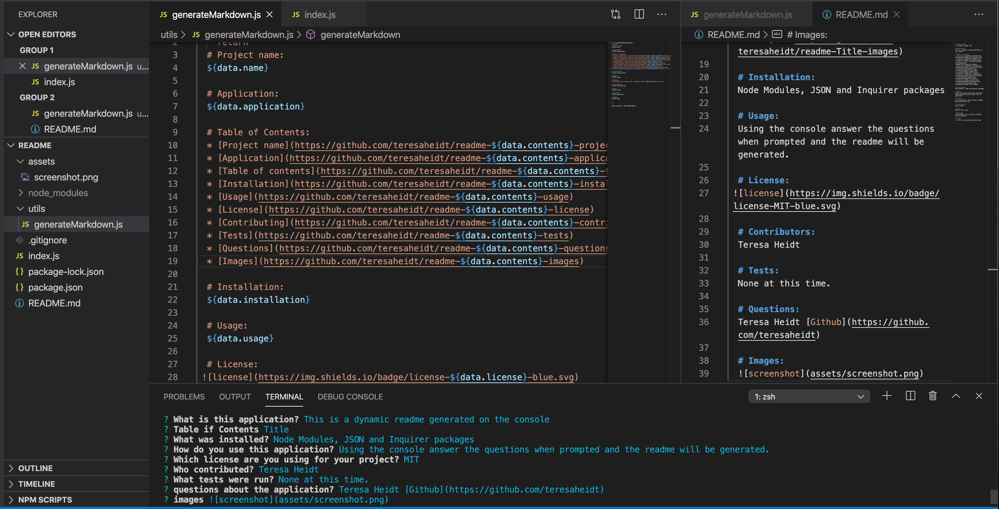

  # Project name:
  T's dynamic readme file.

  # Application:
  This is an application that runs in the command line.

  # Table of Contents:
  * [Project name](https://github.com/teresaheidt/readme-Title-project-name)
  * [Application](https://github.com/teresaheidt/readme-Title-application)
  * [Table of contents](https://github.com/teresaheidt/readme-Title-table-of-contents)
  * [Installation](https://github.com/teresaheidt/readme-Title-installation)
  * [Usage](https://github.com/teresaheidt/readme-Title-usage)
  * [License](https://github.com/teresaheidt/readme-Title-license)
  * [Contributing](https://github.com/teresaheidt/readme-Title-contributors)
  * [Tests](https://github.com/teresaheidt/readme-Title-tests)
  * [Questions](https://github.com/teresaheidt/readme-Title-questions)
  * [Images](https://github.com/teresaheidt/readme-Title-images)

  # Installation:
  Node Modules, JSON and Inquirer packages.

  # Usage:
  In the command line answer the questions when prompted and the readme will be generated.

  # License:
 
 
  # Contributors:
  Teresa Heidt

  # Tests:
  None at this time.

  # Questions:
  Contact Teresa Heidt: [Github](https://github.com/teresaheidt)

  # Images:
  

  